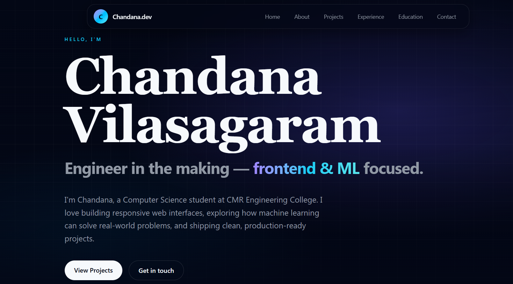

# 🌐 Personal Portfolio Website — Chandana Vilasagaram

A fully responsive personal portfolio website built as part of **Task 1** of the **Future Interns Full Stack Web Development Internship**.

---

## 🚀 Live Demo
https://chandanavilasagaram-portfolio.lovable.app

---

## 📸 Preview



---

## 📌 About the Project

This is a personal portfolio website designed to showcase my profile, skills, projects, experience, and professional journey as a **Frontend & ML-focused engineer**. The site features a modern dark UI, smooth navigation, and fully responsive design across all devices.

---

## ✨ Features

- 🏠 **Hero Section** — Introduction with name, role, and tagline
- 👩‍💻 **About** — Brief overview of who I am
- 🛠️ **Projects** — Showcasing real-world projects built
- 💼 **Experience** — Professional and internship experience
- 🎓 **Education** — Academic background
- 📬 **Contact** — Easy reachability section
- 🌙 **Dark Theme UI** — Modern and elegant design
- 📱 **Fully Responsive** — Works seamlessly on all screen sizes

---

## 🛠️ Tech Stack

| Technology | Usage |
|---|---|
| React | Frontend Framework |
| Tailwind CSS | Styling |
| Vite | Build Tool |
| JavaScript | Logic & Interactivity |
| HTML5 | Structure |

---

## 📂 Project Structure

```
FUTURE_FS_01/
├── public/
│   └── _redirects
├── src/
│   ├── components/
│   ├── pages/
│   ├── assets/
│   └── App.jsx
├── index.html
├── package.json
├── tailwind.config.js
└── vite.config.js
```

---

## ⚙️ Getting Started

### Prerequisites
- Node.js installed
- Git installed

### Installation

```bash
# Clone the repository
git clone https://github.com/Chandana1707/FUTURE_FS_01.git

# Navigate to project directory
cd FUTURE_FS_01

# Install dependencies
npm install

# Start development server
npm run dev
```

---

## 🌍 Deployment

This project is deployed using **Netlify**.

To deploy your own version:
1. Fork this repository
2. Connect to Netlify
3. Set build command: `npm run build`
4. Set publish directory: `dist`

---

## 🎓 Internship Details

- **Program:** Full Stack Web Development Internship
- **Organization:** Future Interns
- **Task:** Task 1 — Personal Professional Portfolio Website
- **College:** CMR Engineering College
- **Platform:** NxtWave

---

## 👩‍💻 Author

**Chandana Vilasagaram**
- 🔗 [LinkedIn](https://www.linkedin.com/in/chandanavilasagaram/)
- 🐙 [GitHub](https://github.com/Chandana1707)

---

## 📄 License

This project is open source and available under the [MIT License](LICENSE).
